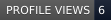
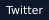
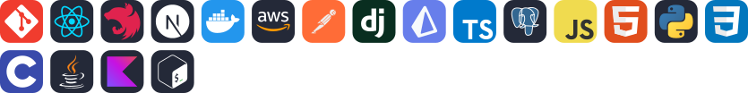
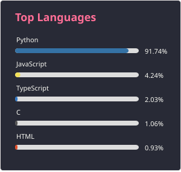
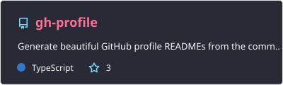
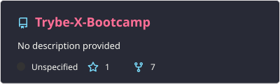
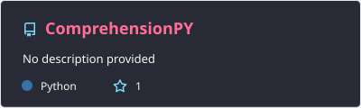
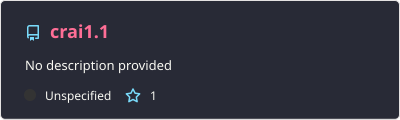

  <h1>Abdulquddus ibrahim</h1>
  
<strong>Resist the Temptation to code.</strong>

 

  
&nbsp;&nbsp;&nbsp;&nbsp;

 

  <h3>Social Connections</h3>

&nbsp;&nbsp;&nbsp;&nbsp;

  

  <h3>GitHub Performance</h3>

| Repos | Stars | Forks | Commits |
| :--- | :--- | :--- | :--- |
| 96 | 16 | 9 | Active |

  

 

  <h3>Tech Stack</h3>

  
    
  

 

  <h3>Featured Projects</h3>

  
  
  
  
  

  

  Generated with <a href="https://github.com/Xclusive09/gh-profile">gh-profile</a> • 2026

